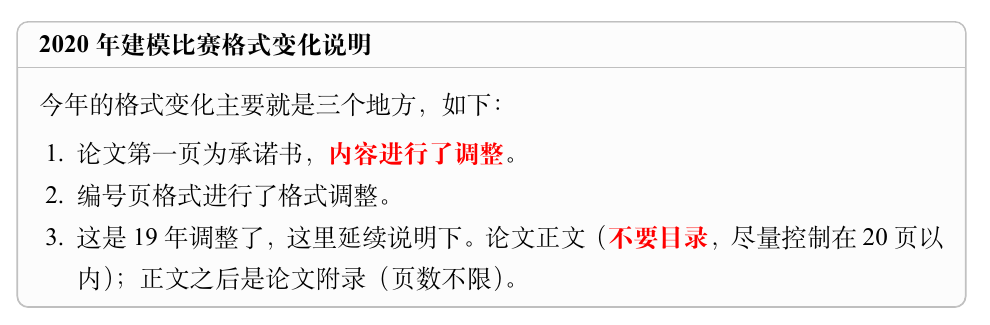
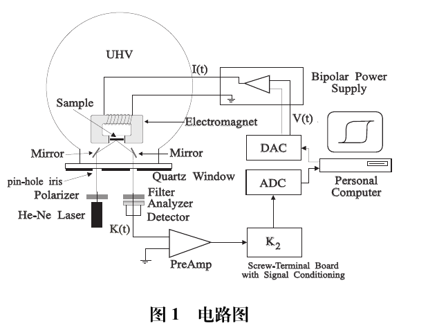

[TOC]

# latex命令速查

- 创建文本框

  ```latex
  \begin{mdframed} [%
  	roundcorner=5pt,
  	linecolor=gray!50,
  	outerlinewidth=0.5pt,
  	middlelinewidth=0.3pt, backgroundcolor=gray!2,
  innertopmargin=\topskip, frametitle={2020 年建模比赛格式变化说明},
  frametitlefont= \bfseries,frametitlerule=true,frametitlealignment =\raggedright\noindent,
  frametitlerulewidth=.5pt, frametitlebackgroundcolor=gray!2,]
  今年的格式变化主要就是三个地方，如下：
  \begin{enumerate}
  \item 论文第一页为承诺书，\textbf{\color{red}内容进行了调整}。
  
  \item 编号页格式进行了格式调整。
  
  \item 这是19年调整了，这里延续说明下。论文正文（\textbf{\color{red}不要目录}，尽量控制在20页以内）；正文之后是论文附录（页数不限）。
  
  \end{enumerate}
  
  \end{mdframed}
  ```

  

可用于写思路说明、流程控制等。


- 中文中包含英文处理

```latex
\verb|\tableofcontents|
```


- 命令框

```latex
\begin{tcode}
    \documentclass[withoutpreface]{cumcmthesis}
\end{tcode}
```


- 文字自带url

  ```latex
  \href{https://mirrors.tuna.tsinghua.edu.cn/github-release/texstudio-org/texstudio/LatestRelease/}{\TeX{}studio}
  ```

- 添加下划线

```latex
\uwave{关注我们的微信公众号}：
```

- 网址链接

```latex
\url{https://www.latexstudio.net}
```

- 模板样式

```latex
\begin{tcode}
    \documentclass{cumcmthesis}
    %\documentclass[withoutpreface,bwprint]{cumcmthesis} %去掉封面与编号页

    \title{论文题目}
    \tihao{A}            % 题号
    \baominghao{4321}    % 报名号
    \schoolname{你的大学}
    \membera{成员A}
    \memberb{成员B}
    \memberc{成员C}
    \supervisor{指导老师}
    \yearinput{2017}     % 年
    \monthinput{08}      % 月
    \dayinput{22}        % 日

    \begin{document}
        \maketitle
        \begin{abstract}
            摘要的具体内容。
            \keywords{关键词1\quad  关键词2\quad   关键词3}
        \end{abstract}
        \tableofcontents
        \section{问题重述}
        \subsection{问题的提出}
        \section{模型的假设}
        \section{符号说明}
        \begin{center}
            \begin{tabular}{cc}
                \hline
                \makebox[0.3\textwidth][c]{符号}	&  \makebox[0.4\textwidth][c]{意义} \\ \hline
                D	    & 木条宽度（cm） \\ \hline
            \end{tabular}
        \end{center}
        \section{问题分析}
        \section{总结}
        \begin{thebibliography}{9}%宽度9
            \bibitem{bib:one} ....
        \end{thebibliography}
        \begin{appendices}
            附录的内容。
        \end{appendices}
    \end{document}
\end{tcode}
```


## 图片操作

### 居中插入图片

```latex
\centerline{\includegraphics[width=6cm]{gongzhonghao2}}
```


### 简单插入图片

```latex
\begin{figure}[!h]
    \centering
    \includegraphics[width=0.6\textwidth]{smokeblk}
    \caption{电路图}
    \label{fig:circuit-diagram}
\end{figure}
```




### 并排插入图片

minipage 环境来展示一个简单的例子。注意，以下例子用到了subcaption命令，需要加载 subcaption 宏包。

```latex
\begin{figure}
    \centering
    \begin{minipage}[c]{0.3\textwidth}
        \centering
        \includegraphics[width=0.95\textwidth]{f1}
        \subcaption{流程图}
        \label{fig:sample-figure-a}
    \end{minipage}
    \begin{minipage}[c]{0.3\textwidth}
        \centering
        \includegraphics[width=0.95\textwidth]{f1}
        \subcaption{流程图}
        \label{fig:sample-figure-b}
    \end{minipage}
    \begin{minipage}[c]{0.3\textwidth}
        \centering
        \includegraphics[width=0.95\textwidth]{f1}
        \subcaption{流程图}
        \label{fig:sample-figure-c}
    \end{minipage}
    \caption{多图并排示例}
    \label{fig:sample-figure}
\end{figure}
```


这相当于整体是一张大图片，大图片引用是\cref{fig:sample-figure}图2，子图引用别分是\cref{fig:sample-figure-a}图2a、\cref{fig:sample-figure-b}图2b、\cref{fig:sample-figure-c}图2c。

### 并排图片高度一致

如果原本两张图片的高度不同，但是希望它们缩放后等高的排在同一行，参考这个例子：

```latex
\begin{figure}
    \centering
    \begin{minipage}[c]{0.48\textwidth}
        \centering
        \includegraphics[height=0.2\textheight]{cat}
        \subcaption{一只猫}
    \end{minipage}
    \begin{minipage}[c]{0.48\textwidth}
        \centering
        \includegraphics[height=0.2\textheight]{smokeblk}
        \subcaption{电路图}
    \end{minipage}
    \caption{多图并排示例}
\end{figure}
```


### 位图 jpg png


### 矢量图 pdf


## 表格

### 普通三线表格

**booktabs**包

表格应具有三线表格式，因此常用 booktabs宏包，其标准格式如`\cref{tab:001}~`所示。

```latex
\begin{table}[!htbp]
    \caption{标准三线表格}\label{tab:001} \centering
    \begin{tabular}{ccccc}
        \toprule[1.5pt]
        $D$(in) & $P_u$(lbs) & $u_u$(in) & $\beta$ & $G_f$(psi.in)\\
        \midrule[1pt]
        5 & 269.8 & 0.000674 & 1.79 & 0.04089\\
        10 & 421.0 & 0.001035 & 3.59 & 0.04089\\
        20 & 640.2 & 0.001565 & 7.18 & 0.04089\\
        \bottomrule[1.5pt]
    \end{tabular}
\end{table}
```


```latex
其绘制表格的代码及其说明如下。
\begin{tcode}
    \begin{table}[!htbp]
        \caption[标签名]{中文标题}
        \begin{tabular}{cc...c}
            \toprule[1.5pt]
            表头第1个格   & 表头第2个格   & ... & 表头第n个格  \\
            \midrule[1pt]
            表中数据(1,1) & 表中数据(1,2) & ... & 表中数据(1,n)\\
            表中数据(2,1) & 表中数据(2,2) & ... & 表中数据(2,n)\\
            ...................................................\\
            表中数据(m,1) & 表中数据(m,2) & ... & 表中数据(m,n)\\
            \bottomrule[1.5pt]
        \end{tabular}
    \end{table}
\end{tcode}
```


## 公式

- 行内公式 --  角度

```latex
$ \theta $ 
```

- 行内公式不用编号

```latex
\[
E=mc^2
\]
其中 $ E $ 是能量，$ m $ 是质量，$ c $ 是光速。
```


### 简单公式带编号引用

```latex
如果希望某个公式带编号，并且在后文中引用可以参考下面的写法：
\begin{equation}
E=mc^2
\label{eq:energy}
\end{equation}

式\cref{eq:energy}是质能方程
```


### 多行公式

```latex
\begin{align}
P & = UI \\
& = I^2R
\end{align}
```


### 矩阵

```latex
\[
\mathbf{X} = \left(
    \begin{array}{cccc}
    x_{11} & x_{12} & \ldots & x_{1n}\\
    x_{21} & x_{22} & \ldots & x_{2n}\\
    \vdots & \vdots & \ddots & \vdots\\
    x_{n1} & x_{n2} & \ldots & x_{nn}\\
    \end{array} \right)
\]
```


### 分段函数

```latex
\[
f(x) =
    \begin{cases}
        0 &  x \text{为无理数} ,\\
        1 &  x \text{为有理数} .
    \end{cases}
\]
```


### 加粗字母

```latex
$\bm{math symbol}$

% eg
$ \alpha a\bm{\alpha a} $
```

### 公式中的文本

```latex
\text{文本环境}
```


### 定理

下面简单介绍一下定理、证明等环境的使用。

```latex
\begin{definition}
    定义环境
    \label{def:nosense}
\end{definition}
\cref{def:nosense}除了告诉你怎么使用这个环境以外，没有什么其它的意义。

除了 definition 环境，还可以使用 theorem 、lemma、corollary、assumption、conjecture、axiom、principle、problem、example、proof、solution 这些环境，根据论文的实际需求合理使用。

\begin{theorem}
    这是一个定理。
    \label{thm:example}
\end{theorem}
由\cref{thm:example}我们知道了定理环境的使用。

\begin{lemma}
    这是一个引理。
    \label{lem:example}
\end{lemma}
由\cref{lem:example}我们知道了引理环境的使用。

\begin{corollary}
    这是一个推论。
    \label{cor:example}
\end{corollary}
由\cref{cor:example}我们知道了推论环境的使用。

\begin{assumption}
    这是一个假设。
    \label{asu:example}
\end{assumption}
由\cref{asu:example}我们知道了假设环境的使用。

\begin{conjecture}
    这是一个猜想。
    \label{con:example}
\end{conjecture}
由\cref{con:example}我们知道了猜想环境的使用。

\begin{axiom}
    这是一个公理。
    \label{axi:example}
\end{axiom}
由\cref{axi:example}我们知道了公理环境的使用。

\begin{principle}
    这是一个定律。
    \label{pri:example}
\end{principle}
由\cref{pri:example}我们知道了定律环境的使用。


\begin{problem}
    这是一个问题。
    \label{pro:example}
\end{problem}
由\cref{pro:example}我们知道了问题环境的使用。


\begin{example}
    这是一个例子。
    \label{exa:example}
\end{example}
由\cref{exa:example}我们知道了例子环境的使用。

\begin{proof}
    这是一个证明。
    \label{prf:example}
\end{proof}
由\cref{prf:example}我们知道了证明环境的使用。

\begin{solution}
    这是一个解。
    \label{sol:example}
\end{solution}
由\cref{sol:example}我们知道了解环境的使用。
```


### 脚注

```latex
\footnote{具体内容}
```

### 无序列表 itemize

```latex
\begin{itemize}
    \item one
    \item two
    \item ...
\end{itemize}
```

### 有序列表 enumerate

```latex
\begin{enumerate}
    \item one
    \item two
    \item ...
\end{enumerate}
```


### 加粗与斜体

```latex
\textbf{加粗}

\textit{斜体 Italics} % 只有英文有
```

### 引用

```latex
\cite{bibkey}
```


```latex
\begin{table}[htbp]
    \centering
    \caption{宏包罗列}
    \begin{tabular}{ccccc}
        \toprule
        \multicolumn{5}{c}{模板中已经加载的宏包} \\
        \midrule
        amsbsy & amsfonts & {amsgen} & {amsmath} & {amsopn} \\
        amssymb & amstext & {appendix} & {array} & {atbegshi} \\
        atveryend & auxhook & {bigdelim} & {bigintcalc} & {bigstrut} \\
        bitset & bm    & {booktabs} & {calc} & {caption} \\
        caption3 & CJKfntef & {cprotect} & {ctex} & {ctexhook} \\
        ctexpatch & enumitem & {etexcmds} & {etoolbox} & {everysel} \\
        expl3 & fix-cm & {fontenc} & {fontspec} & {fontspec-xetex} \\
        geometry & gettitlestring & {graphics} & {graphicx} & {hobsub} \\
        hobsub-generic & hobsub-hyperref & {hopatch} & {hxetex} & {hycolor} \\
        hyperref & ifluatex & {ifpdf} & {ifthen} & {ifvtex} \\
        ifxetex & indentfirst & {infwarerr} & {intcalc} & {keyval} \\
        kvdefinekeys & kvoptions & {kvsetkeys} & {l3keys2e} & {letltxmacro} \\
        listings & longtable & {lstmisc} & {ltcaption} & {ltxcmds} \\
        multirow & nameref & {pdfescape} & {pdftexcmds} & {refcount} \\
        rerunfilecheck & stringenc & {suffix} & {titletoc} & {tocloft} \\
        trig  & ulem  & {uniquecounter} & {url} & {xcolor} \\
        xcolor-patch & xeCJK & {xeCJKfntef} & {xeCJK-listings} & {xparse} \\
        xtemplate & zhnumber &       &       &  \\
        \bottomrule
    \end{tabular}%
    \label{tab:addlabel}%
\end{table}%
```

